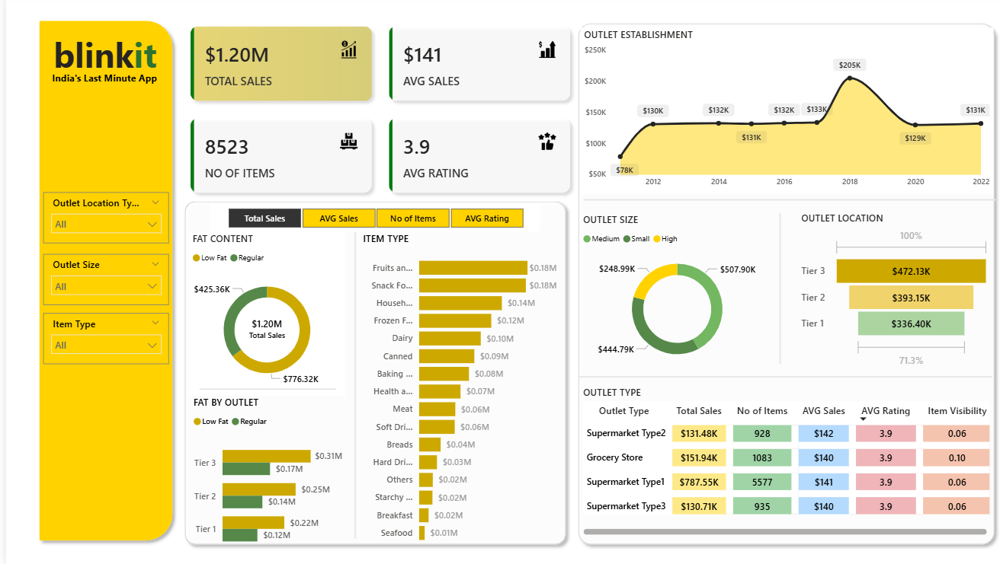

## 🛒 BlinkIT Grocery Data Dashboard



### 📌 Overview
The **BlinkIT Grocery Data Dashboard** is a Power BI project that visualizes grocery sales performance metrics using real transactional data.  
It provides insights into sales trends, customer ratings, and item performance to support data-driven decision-making.

---

### 📂 Project Structure
```

BlinkIT/
│
├── BlinkIt.pbix                  # Power BI dashboard file
├── BlinkIT Grocery Data.xlsx     # Raw dataset used in Power BI
├── background kpi.png            # Dashboard background design
└── Images/                       # Exported visuals and charts
├── Avg Sales.png
├── Items.png
├── Sales.png
└── rating (1).png

```

---

### 📊 Key Insights
- **Sales Overview:** Total revenue and trends across different periods.  
- **Product Performance:** Comparison of item sales volume and average selling price.  
- **Customer Ratings:** Distribution of ratings and correlation with sales.  
- **KPIs Dashboard:** Quick view of main performance indicators like total sales, average sales, and item count.

---

### ⚙️ How to Use
1. **Open Power BI Desktop.**  
2. Go to **File → Open → BlinkIt.pbix**.  
3. If prompted, **update the data source path** to match the location of `BlinkIT Grocery Data.xlsx`.  
4. Click **Refresh** to load the latest dataset.  
5. Explore the interactive visuals and filters to analyze different aspects of the grocery data.

---

### 🧩 Requirements
- **Microsoft Power BI Desktop** (latest version recommended)  
- **Microsoft Excel** (for viewing/editing the dataset)

---

### 📸 Dashboard Preview
Here are some sample visuals from the dashboard:
| Metric | Preview |
|--------|----------|
| **Average Sales** |  |
| **Items** |  |
| **Ratings** | .png) |

---

### 🧠 Insights Goal
The goal of this dashboard is to provide a **clear, interactive summary** of sales performance that helps:
- Identify best-selling items  
- Understand the impact of ratings on sales  
- Track KPIs like total revenue and average sales over time  

---

### 👨‍💻 Author
**Aayush Shah 🎓**  
*Data Analytics Enthusiast | 📊 Power BI | 🐍 Python | 🗄️ SQL*  
🔗 [LinkedIn Profile](https://www.linkedin.com/in/aayush0329/)

---

## 🪪 License
This project is open-source and available under the [MIT License](LICENSE).

---

## ⭐ Support
If you found this project helpful or inspiring, please **star 🌟 this repository** and connect with me on LinkedIn!  
Your feedback helps me improve and build more real-world data analytics projects.

